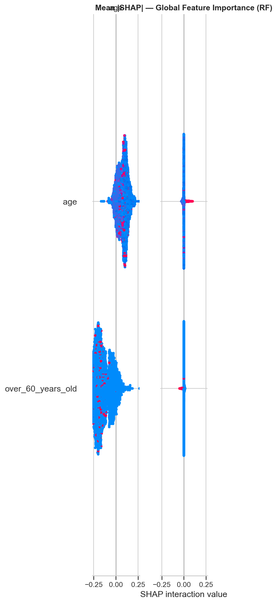
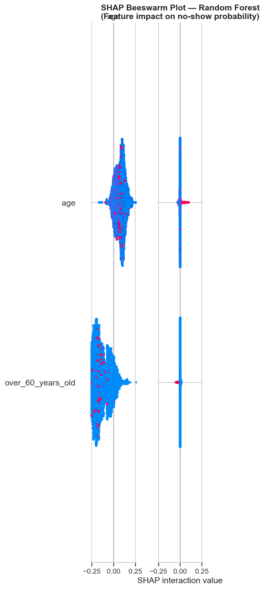
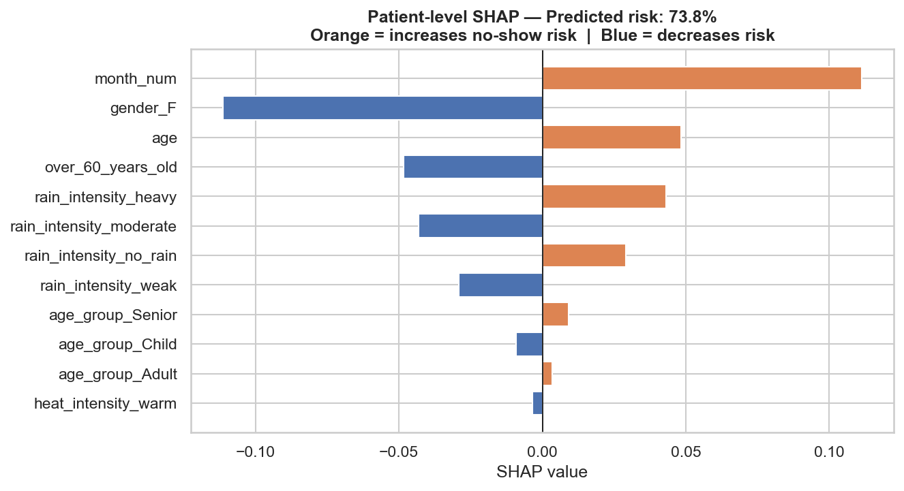

<div align="center">

# Medical Appointment No-Show Risk Predictor

**An end-to-end machine-learning application for identifying appointment no-show risk.**

[](https://www.python.org/)
[](https://streamlit.io/)
[](https://xgboost.readthedocs.io/)
[](https://shap.readthedocs.io/)
[](https://github.com/LikithaDudala/medical-appointment-noshow-predictor/actions/workflows/ci.yml)

</div>

## Overview

Missed appointments reduce clinic capacity and delay access to care. This project builds a classification workflow that estimates no-show risk from appointment, demographic, and weather-related features. It pairs model predictions with SHAP explanations so feature impact can be inspected rather than treated as a black box.

> **Portfolio and educational use only.** This project is not a clinical decision-support system and predictions must not be the sole basis for care, access, or scheduling decisions.

## Project Snapshot

| Area | Implementation |
| --- | --- |
| **Task** | Binary classification: predict appointment no-show risk |
| **Data** | 49,593 appointment records with 26 columns |
| **Models compared** | Logistic Regression, Decision Tree, Random Forest, Gradient Boosting, SMOTE + Random Forest, XGBoost |
| **Evaluation** | Stratified cross-validation, ROC-AUC, PR-AUC, F1, and threshold selection |
| **Deployment** | Interactive Streamlit application |
| **Explainability** | Global and individual SHAP feature attribution |

## Key Outcomes

- Evaluated six classifiers under a consistent cross-validation strategy.
- Addressed class imbalance with SMOTE and XGBoost `scale_pos_weight` experiments.
- Selected a decision threshold through an F1 sweep instead of using the default 0.50 cutoff.
- Packaged trained artifacts so the Streamlit interface runs without retraining.
- Added SHAP views to make prediction drivers visible at both population and individual levels.

## Model Results

| Model | ROC-AUC | PR-AUC | F1 (no-show) |
| --- | ---: | ---: | ---: |
| **Random Forest** | **0.776** | 0.333 | **0.387** |
| Random Forest + SMOTE | 0.775 | **0.343** | 0.374 |
| XGBoost (application model) | 0.710 | 0.248 | 0.277 |

The Streamlit app serves the XGBoost classifier. A Random Forest artifact is retained to generate SHAP explanations.

## Workflow

```text
Raw appointment data
        |
        v
Cleaning and feature engineering
        |
        v
Stratified validation and model comparison
        |
        v
Threshold selection and model serialization
        |
        v
Streamlit risk scoring + SHAP explanations
```

## Explainability

| Global feature importance | Feature impact distribution | Individual prediction explanation |
| --- | --- | --- |
|  |  |  |

## Quick Start

```bash
git clone https://github.com/LikithaDudala/medical-appointment-noshow-predictor.git
cd medical-appointment-noshow-predictor
python -m venv .venv
```

Activate the environment, install dependencies, and launch the application:

```bash
pip install -r requirements.txt
streamlit run app.py
```

## Reproduce the Analysis

The notebook contains the full exploration, feature engineering, training, evaluation, and artifact-generation workflow.

```bash
jupyter notebook Medical_Appointments_NoShow.ipynb
```

## Repository Structure

```text
.
|-- app.py                              # Streamlit prediction interface
|-- Medical_Appointments_NoShow.ipynb   # EDA, modeling, and evaluation workflow
|-- medical-appointments-no-show-en.csv # Source dataset
|-- models/                              # Serialized models and feature metadata
|-- assets/                              # SHAP visualizations
|-- requirements.txt                     # Python dependencies
`-- .github/workflows/ci.yml             # GitHub Actions syntax validation
```

## Technical Stack

`Python` `pandas` `NumPy` `scikit-learn` `XGBoost` `imbalanced-learn` `SHAP` `Matplotlib` `Seaborn` `Streamlit` `Jupyter`

## Data, Privacy, and Limitations

The repository includes `medical-appointments-no-show-en.csv` to support reproducibility. Treat it as sensitive healthcare-related data: do not use it to identify people, make clinical decisions, or redistribute it outside the permissions governing the source data.

- The data represents a specific historical population and may not generalize to other clinics or regions.
- No monitoring, fairness assessment, or retraining process is implemented.
- Reported metrics are experimental estimates, not production guarantees.
- Serialized pickle artifacts should be loaded only from this trusted repository.
